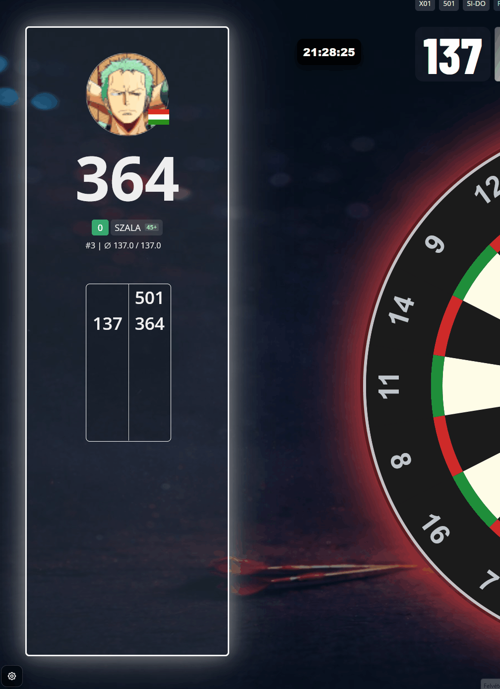
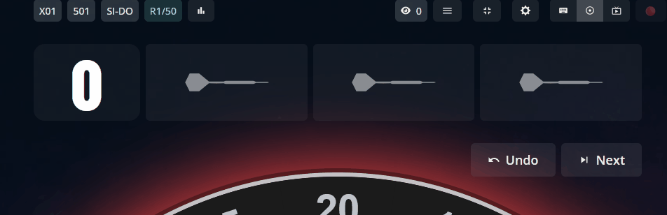
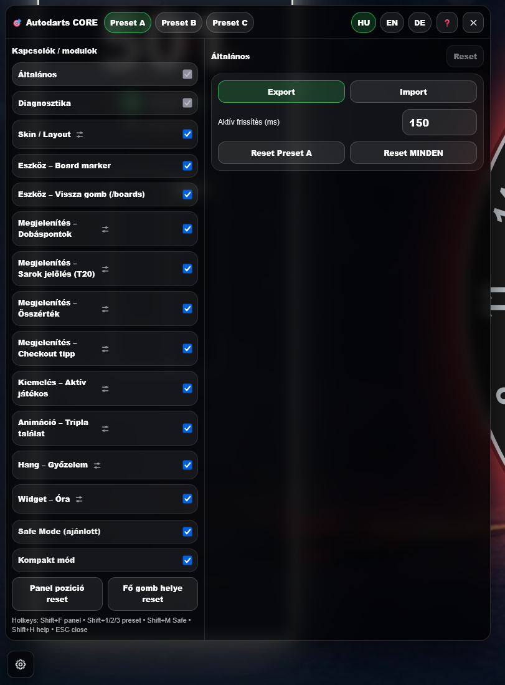
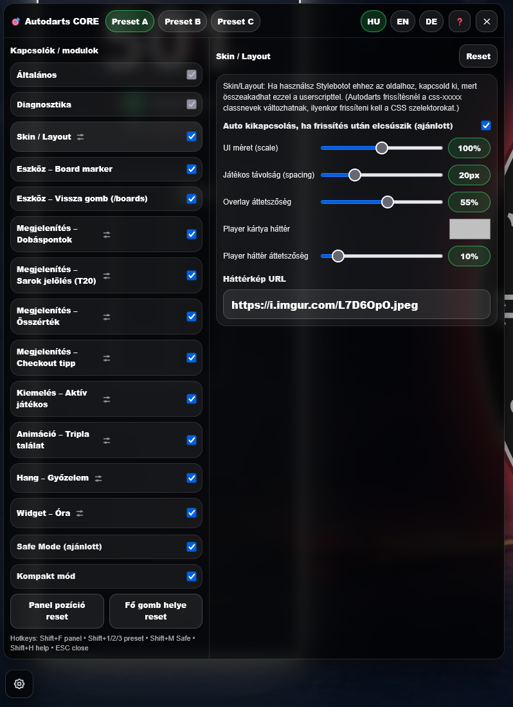
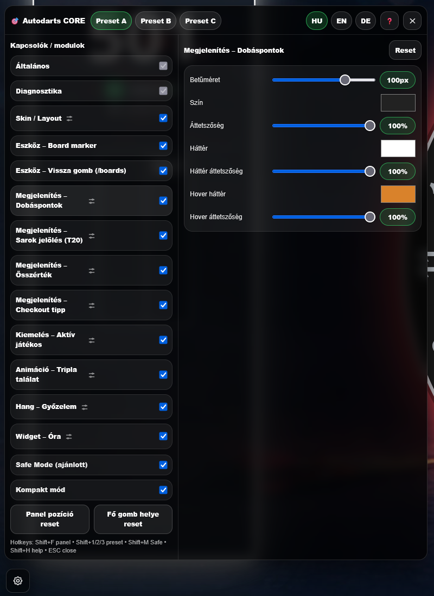
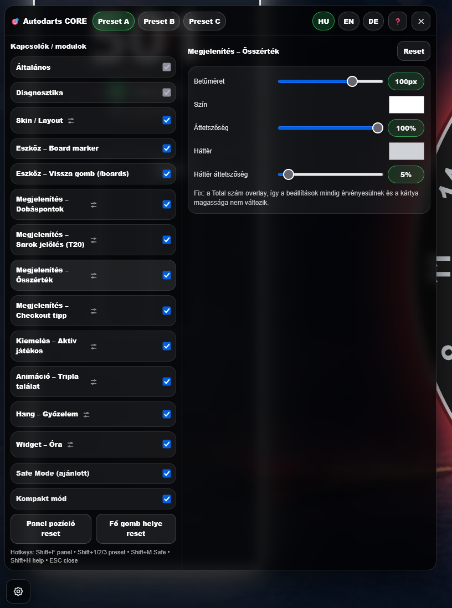
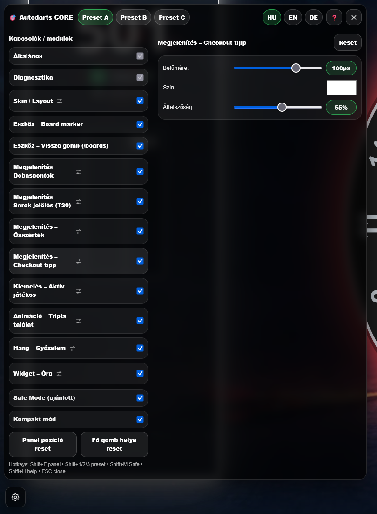
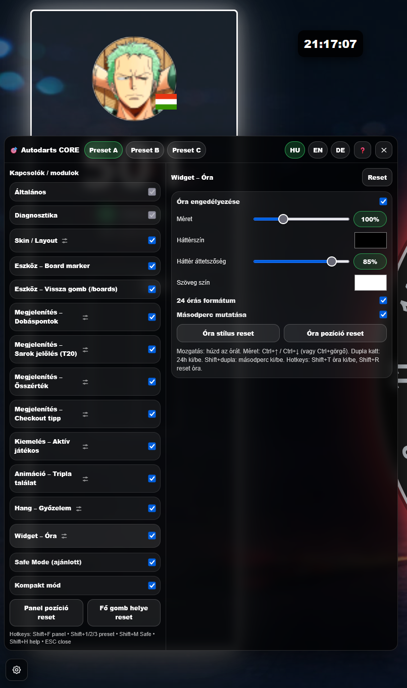

# Autodarts CORE (Userscript)

Modułowy userscript dla play.autodarts.io, który dodaje konfigurowalny panel CORE z presetami i ulepszeniami interfejsu.

⚠️ Uwaga: Ten projekt jest tworzony przez społeczność i nie jest powiązany z Autodarts.

Funkcje
Presety A/B/C
Interfejs w językach HU / EN / DE
Tryb bezpieczny
Przełączany Skin / Layout (wbudowany CSS)
Konwersja rzutów → punktów (T20 → 60, D2 → 4, itd.)
Poprawka nakładki Total
Podświetlanie podpowiedzi checkoutu
Podświetlanie aktywnego gracza
Animacja trafienia potrójnego
Opcjonalna muzyka zwycięstwa
Pływający widget zegara
Narzędzie do oznaczania tarczy
Opcjonalny przycisk „Powrót do Autodarts” na stronie `/boards`

---

## Podgląd

### GIFs

 

### Screenshots

---

## Obsługiwane strony
Interfejs meczu: https://play.autodarts.com/matches/...
Strona tablic (opcjonalny przycisk powrotu): https://play.autodarts.com/boards

---

## Skróty klawiszowe
Shift+F — przełącz panel
Shift+1 / Shift+2 / Shift+3 — Preset A / B / C
Shift+M — przełącz Tryb Bezpieczny
Shift+H — przełącz pomoc
Shift+T — przełącz zegar
Shift+R — reset zegara
ESC — zamknij panel

---

## Instalacja

### Violentmonkey (Firefox)
1. Zainstaluj Violentmonkey
2. Otwórz adres RAW skryptu:
https://raw.githubusercontent.com/Szala86/Autodarts-core/main/autodarts-core.user.js
3. Kliknij Install

### Tampermonkey (Chrome)
1. Zainstaluj Tampermonkey
2. Otwórz adres RAW skryptu:
https://raw.githubusercontent.com/Szala86/Autodarts-core/main/autodarts-core.user.js
3. Kliknij Install

---

## Aktualizacje
Użyj menedżera userscriptów:
„Sprawdź aktualizacje” (lub automatyczne aktualizacje, jeśli są włączone)

---

## Uwagi dotyczące użytkowania
Presety A/B/C przechowują osobne ustawienia.
Tryb Bezpieczny ogranicza skrajne wartości, aby interfejs pozostał stabilny.
Jeśli używasz Stylebot na play.autodarts.io, wyłącz go, aby uniknąć konfliktów z modułem Skin/Layout.

---

## Rozwiązywanie problemów
Aktualizacje Autodarts mogą zmieniać hashowane klasy Chakra (.css-xxxxx).
Preferuj stabilne selektory, takie jak:

#ad-ext-turn
#ad-ext-player-display

własne klasy, które kontrolujesz

---

## Licencja
